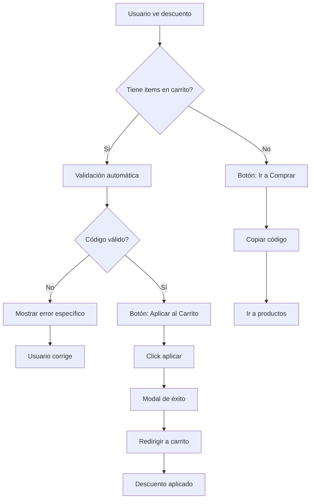

# 🚀 Funcionalidades Avanzadas - Sistema de Descuentos DUOC

## 📋 Nuevas Características Implementadas

### 1️⃣ Validación en Tiempo Real del Código

El sistema ahora valida automáticamente los códigos de descuento en tiempo real, mostrando feedback visual instantáneo al usuario.

#### Proceso de Validación

```javascript
// Se ejecuta automáticamente al cargar la página
const validation = validateDiscountCode(codigo, userEmail);
```

#### Estados de Validación

**✅ Código Válido**
- **Visual:** Borde verde neón con efecto glow
- **Mensaje:** Porcentaje de descuento o "Envío gratis"
- **Acción:** Habilita el botón "Aplicar al Carrito"

**⚠️ Código Inválido - Motivos:**
1. **Código no existe**
   - Mensaje: "Código inválido"
   
2. **No es estudiante DUOC**
   - Mensaje: "Exclusivo para estudiantes DUOC UC"
   
3. **Monto mínimo no alcanzado**
   - Mensaje: "Monto mínimo: $XX.XXX"
   - Ejemplo: Bundle requiere $50.000
   
4. **Categoría incorrecta**
   - Mensaje: "Solo para productos de: [categoría]"
   - Ejemplo: DUOC20ACC solo aplica a accesorios

#### Validaciones Implementadas

| Código | Validación | Requisito |
|--------|-----------|-----------|
| `DUOC20ACC` | ✓ Email @duoc.cl<br>✓ Productos de accesorios | Debe tener items de categoría "accesorios" |
| `DUOCBUNDLE25` | ✓ Email @duoc.cl<br>✓ Monto mínimo<br>✓ Productos bundle | Subtotal ≥ $50.000 + items "bundle" |
| `DUOCSHIP` | ✓ Email @duoc.cl | Sin restricciones adicionales |

---

### 2️⃣ Integración Completa con el Carrito de Compras

El sistema ahora se conecta directamente con el carrito, permitiendo aplicar descuentos en un solo click.

#### Flujo de Integración

```
Usuario ve descuento → Valida código → Aplica al carrito → Redirige a checkout
```

#### Características de la Integración

**📊 Información del Carrito en Vivo**
```
🛒 Tienes 3 producto(s) en tu carrito
Subtotal: $85.000
```

**🔄 Estados Dinámicos del Botón Principal**

1. **Carrito Vacío:**
   - Botón: `🛍️ Ir a Comprar`
   - Acción: Copia código y redirige a productos

2. **Carrito con Items (sin descuento aplicado):**
   - Botón: `🛒 Aplicar al Carrito`
   - Acción: Aplica descuento directamente y redirige al carrito

3. **Descuento ya Aplicado:**
   - Botón: `✅ Ver Carrito`
   - Visual: Mensaje "✅ Descuento ya aplicado al carrito"
   - Acción: Redirige al carrito

#### Validación Automática en el Carrito

El sistema valida automáticamente:
- ✅ Monto total del carrito
- ✅ Categorías de productos
- ✅ Email del usuario
- ✅ Código no duplicado

---

### 3️⃣ Sistema de Notificaciones Mejorado

Las notificaciones ahora son más informativas y contextuales.

#### Tipos de Notificaciones

**✅ Éxito**
```
✅ ¡Descuento del 20% aplicado!
✅ Envío gratis aplicado a tu compra
```

**⚠️ Advertencia**
```
⚠️ Monto mínimo requerido: $50.000
⚠️ Este código solo aplica para productos de: accesorios
```

**❌ Error**
```
❌ Código de descuento inválido
⚠️ Este código es exclusivo para estudiantes DUOC UC
```

---

## 🎨 Nuevos Elementos Visuales

### Indicador de Validación en Tiempo Real

```css
.validation-result.valid {
  background: rgba(0, 255, 157, 0.15);
  border: 2px solid #00ff9d;
  color: #00ff9d;
  box-shadow: 0 0 15px rgba(0, 255, 157, 0.3);
}
```

### Panel de Información del Carrito

```css
.cart-info {
  background: rgba(0, 184, 255, 0.1);
  border: 2px solid #00b8ff;
  color: #00b8ff;
}
```

### Spinner de Carga

```css
.spinner {
  border: 3px solid rgba(0, 255, 157, 0.3);
  border-top: 3px solid #00ff9d;
  animation: spin 0.8s linear infinite;
}
```

---

## 🔧 API del CartContext Actualizada

### Nuevas Funciones Disponibles

#### `validateDiscountCode(code, userEmail)`
Valida un código sin aplicarlo.

**Parámetros:**
- `code` (string): Código a validar
- `userEmail` (string): Email del usuario

**Retorna:**
```javascript
{
  valid: boolean,
  message: string,
  data?: {
    percent: number,
    type: string,
    minAmount: number,
    category: string | null,
    freeShipping?: boolean
  }
}
```

**Ejemplo:**
```javascript
const validation = validateDiscountCode('DUOC20ACC', 'estudiante@duoc.cl');
if (validation.valid) {
  console.log(validation.message); // "20% de descuento"
}
```

#### `applyDiscount(code, userEmail)`
Aplica un descuento al carrito.

**Parámetros:**
- `code` (string): Código a aplicar
- `userEmail` (string): Email del usuario

**Retorna:**
```javascript
{
  success: boolean,
  error?: string, // 'invalid_code' | 'duoc_only' | 'min_amount' | 'category_mismatch'
  discount?: object
}
```

**Ejemplo:**
```javascript
const result = applyDiscount('DUOC20ACC', user.email);
if (result.success) {
  navigate('/carrito');
}
```

#### `removeDiscount()`
Elimina el descuento aplicado.

**Ejemplo:**
```javascript
removeDiscount();
```

#### `getCartTotalWithDiscount()`
Calcula el total del carrito con el descuento aplicado.

**Retorna:** `number`

**Ejemplo:**
```javascript
const total = getCartTotalWithDiscount();
console.log(`Total con descuento: $${total.toLocaleString('es-CL')}`);
```

### Estado del Carrito

```javascript
const { 
  cart,              // Array de productos
  appliedDiscount,   // Descuento activo o null
  getCartTotal,      // Subtotal sin descuento
  getCartTotalWithDiscount  // Total con descuento
} = useCart();
```

---

## 🧪 Casos de Prueba Detallados

### Caso 1: Aplicar Descuento con Carrito Vacío

**Pasos:**
1. Ir a `/descuentos/accesorios`
2. Verificar que el carrito está vacío
3. Click en "Ir a Comprar"

**Resultado Esperado:**
- ✅ Código copiado al portapapeles
- ✅ Redirección a `/productos?categoria=accesorios`

---

### Caso 2: Aplicar Descuento con Items en el Carrito

**Pasos:**
1. Agregar 2 accesorios al carrito (ej: teclado + mouse)
2. Ir a `/descuentos/accesorios`
3. Verificar validación en tiempo real
4. Click en "Aplicar al Carrito"

**Resultado Esperado:**
- ✅ Validación muestra "✅ 20% de descuento"
- ✅ Panel muestra info del carrito
- ✅ Modal de éxito aparece
- ✅ Redirección a `/carrito`
- ✅ Descuento aplicado y visible en el carrito

---

### Caso 3: Código con Monto Mínimo

**Pasos:**
1. Agregar bundle de $30.000 al carrito
2. Ir a `/descuentos/bundle`
3. Observar validación

**Resultado Esperado:**
- ⚠️ Validación muestra: "Monto mínimo: $50.000"
- ❌ Botón "Aplicar al Carrito" deshabilitado
- ✅ Mensaje claro de error

**Pasos Adicionales:**
1. Agregar más productos hasta superar $50.000
2. La validación se actualiza automáticamente
3. ✅ Validación ahora muestra "✅ 25% de descuento"
4. ✅ Botón se habilita

---

### Caso 4: Categoría Incorrecta

**Pasos:**
1. Agregar consola al carrito
2. Ir a `/descuentos/accesorios`
3. Intentar aplicar código

**Resultado Esperado:**
- ⚠️ Validación: "Solo para productos de: accesorios"
- ❌ Botón deshabilitado
- 💡 Usuario sabe que debe agregar accesorios

---

### Caso 5: Descuento ya Aplicado

**Pasos:**
1. Aplicar descuento exitosamente
2. Volver a `/descuentos/accesorios`
3. Observar cambios en la interfaz

**Resultado Esperado:**
- ✅ Panel muestra: "✅ Descuento ya aplicado al carrito"
- 🔄 Botón cambia a "✅ Ver Carrito"
- ✅ Click redirige directamente al carrito

---

## 📊 Flujo Completo de Usuario



---

## 🎯 Ventajas del Sistema

### Para el Usuario
✅ **Validación instantánea** - Sabe de inmediato si el código funciona
✅ **Aplicación en un click** - No necesita copiar/pegar manualmente
✅ **Feedback claro** - Entiende exactamente por qué un código no funciona
✅ **Integración fluida** - Proceso de compra sin interrupciones

### Para el Negocio
✅ **Menos abandono** - Usuarios no se frustran con códigos inválidos
✅ **Validación automática** - Previene uso indebido de códigos
✅ **Analítica mejorada** - Trackeo de intentos de uso de códigos
✅ **UX consistente** - Experiencia coherente en todo el flujo

---

## 🔐 Validaciones de Seguridad

### Nivel Frontend (Actual)
- ✅ Validación de email @duoc.cl
- ✅ Validación de autenticación
- ✅ Validación de monto mínimo
- ✅ Validación de categoría
- ✅ Prevención de duplicados

### Nivel Backend (Recomendado para Producción)
- 🔄 Verificar email contra base de datos DUOC
- 🔄 Validar límite de usos por código
- 🔄 Validar vigencia temporal del código
- 🔄 Registrar uso de códigos para auditoría
- 🔄 Rate limiting para prevenir abuso

---

## 📝 Códigos de Descuento Disponibles

| Código | Tipo | Descuento | Monto Mín. | Categoría | Duración |
|--------|------|-----------|------------|-----------|----------|
| `DUOC20ACC` | DUOC | 20% | $0 | Accesorios | Permanente |
| `DUOCBUNDLE25` | DUOC | 25% | $50.000 | Bundle | Permanente |
| `DUOCSHIP` | DUOC | Envío Gratis | $0 | Todas | Permanente |
| `LEVELUP10` | General | 10% | $0 | Todas | Permanente |
| `GAMER20` | General | 20% | $0 | Todas | Permanente |
| `FIRSTBUY15` | General | 15% | $0 | Todas | Permanente |

---

## 🚀 Próximas Mejoras Sugeridas

### Funcionalidades Adicionales
- [ ] Sistema de cupones de un solo uso
- [ ] Descuentos por tiempo limitado con countdown
- [ ] Códigos personalizados por estudiante
- [ ] Historial de descuentos usados
- [ ] Compartir códigos con amigos
- [ ] Notificaciones push de nuevos descuentos
- [ ] Programa de puntos acumulables

### Mejoras de UX
- [ ] Preview del descuento aplicado en productos
- [ ] Comparador de precios con/sin descuento
- [ ] Calculadora de ahorro total
- [ ] Badges de "Descuento aplicable" en productos

---

**Última actualización:** 26 de octubre de 2025
**Versión:** 3.0 - Validación en tiempo real + Integración con carrito
